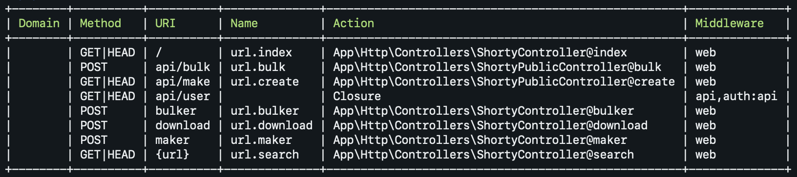

# Shorty

## Descripción: 
Este es un proyecto prueba. Consta de una acortadora de URLs.

## Instalacíon:
- Clona tu proyecto
- Vaya a la aplicación de la carpeta usando el comando cd en su cmd o terminal
- Ejecutar la instalación del compositor en su cmd o terminal
- Copie el archivo .env.example a .env en la carpeta raíz. Puede escribir copy .env.example .env si usa el símbolo del sistema de Windows o cp .env.example .env si usa la terminal, Ubuntu
- Abra su archivo .env y cambie el nombre de la base de datos (DB_DATABASE) a lo que tenga, los campos de nombre de usuario (DB_USERNAME) y contraseña (DB_PASSWORD) corresponden a su configuración.
- Por defecto, el nombre de usuario es root y puede dejar el campo de contraseña vacío. (Esto es para Xampp)
- Por defecto, el nombre de usuario es root y la contraseña también es root. (Esto es para Lamp)
- Ejecutar php clave artesanal: generar
- Ejecutar php artesano migrar.
- Ejecutar php artisan serve.
- Ir a localhost: 8000

Mas Información: https://laravel.com/docs/5.8
